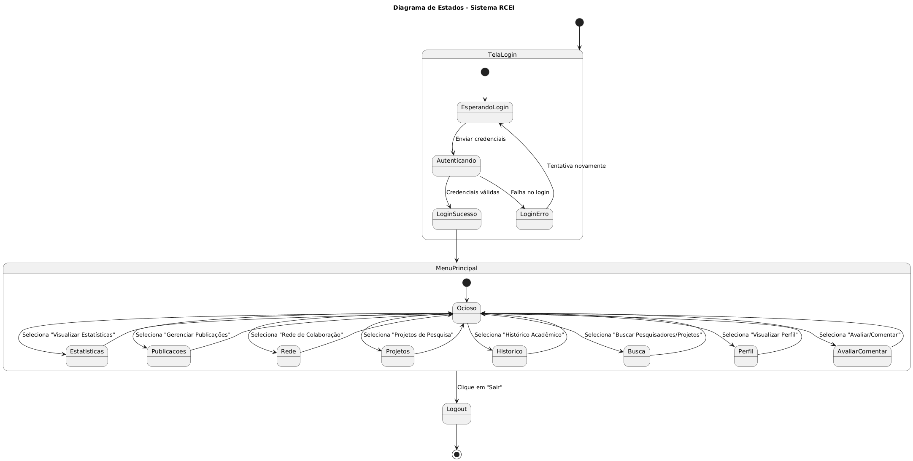

## Diagramas do Projeto

### Diagrama de Casos de Uso  
_Descrição:_ Funcionalidades e atores principais do sistema.  
  

### Diagrama de Classes  
_Descrição:_ Entidades, atributos e relacionamentos do sistema.  
  

### Diagrama de Atividades  
_Descrição:_ Fluxo de trabalho e decisões no sistema.  
  

### Diagrama de Estados  
_Descrição:_ Estados possíveis de um objeto e transições.  
  

### Diagrama de Componentes  
_Descrição:_ Componentes principais do sistema e suas interações.  
  

### Diagrama de Implantação  
_Descrição:_ Arquitetura física e comunicação entre dispositivos.  
  

---