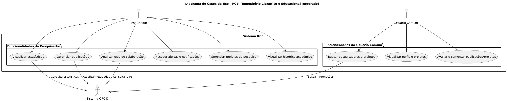
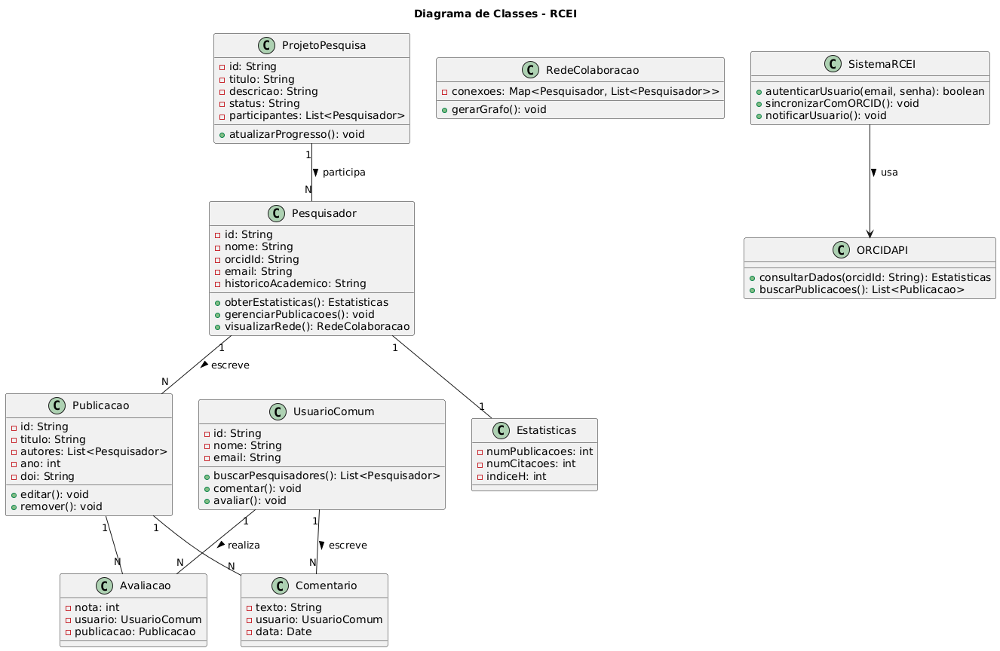
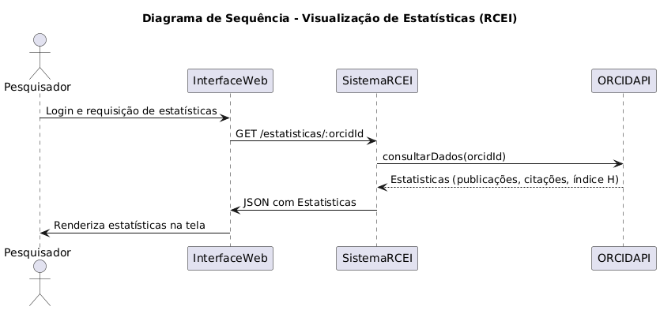
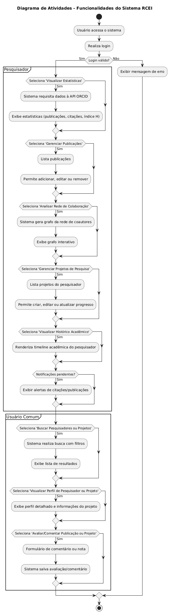
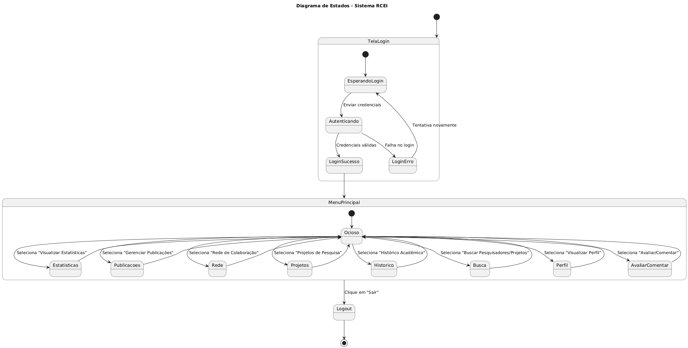
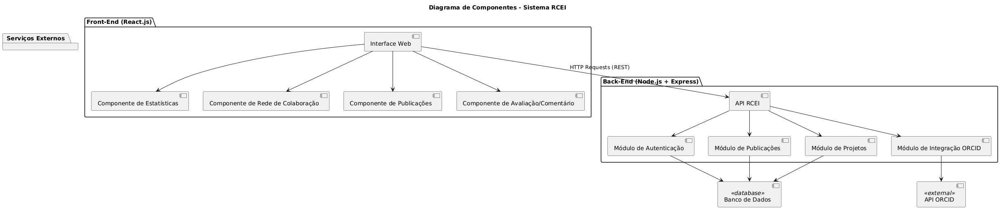
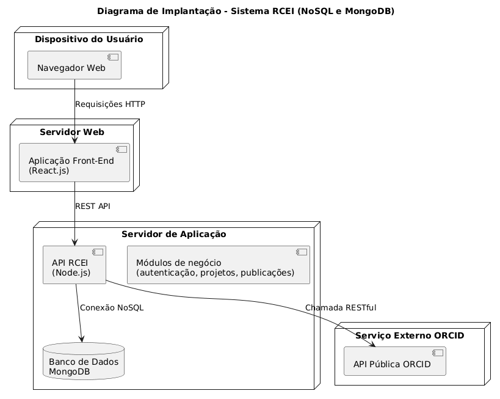

# Apresentação do Projeto ORCID

## Integrantes do Grupo
- Tiago Chaves Bezerra Rocha - 14609637
- Felipe da Costa Coqueiro - 11781361
- 

---

## Introdução e Contextualização
ORCID (Open Researcher and Contributor ID) é um identificador digital único para pesquisadores e autores acadêmicos. Ele resolve a ambiguidade nos nomes, garantindo um ID exclusivo para cada pesquisador.  
Facilita o reconhecimento das contribuições científicas, integra dados de publicações e afiliações de forma segura e padronizada.

---

## Motivação e Objetivos
- Melhorar a usabilidade da plataforma ORCID, criando soluções inovadoras baseadas em sua API pública.
- Entrevistar 3 professores para coleta de requisitos.
- Desenvolver um produto (web, mobile ou desktop) que facilite a interação com dados do ORCID.

---

## Diagramas do Projeto

### Diagrama de Casos de Uso  
_Descrição:_ Funcionalidades e atores principais do sistema.  
  

### Diagrama de Classes  
_Descrição:_ Entidades, atributos e relacionamentos do sistema.  
  

### Diagrama de Sequência  
_Descrição:_ Sequência temporal de interações para um caso de uso.  
  

### Diagrama de Atividades  
_Descrição:_ Fluxo de trabalho e decisões no sistema.  
  

### Diagrama de Estados  
_Descrição:_ Estados possíveis de um objeto e transições.  
  

### Diagrama de Componentes  
_Descrição:_ Componentes principais do sistema e suas interações.  
  

### Diagrama de Implantação  
_Descrição:_ Arquitetura física e comunicação entre dispositivos.  
  

---

## Protótipo Interativo  
Confira o protótipo interativo no Figma:  
[Link para o protótipo no Figma](https://www.figma.com/design/zdev5naDktoL9UD3H1XAqw/RCEI-Versao-1.0.0?node-id=1-4&t=VZS7WbodEZNPjjQg-0)

---

